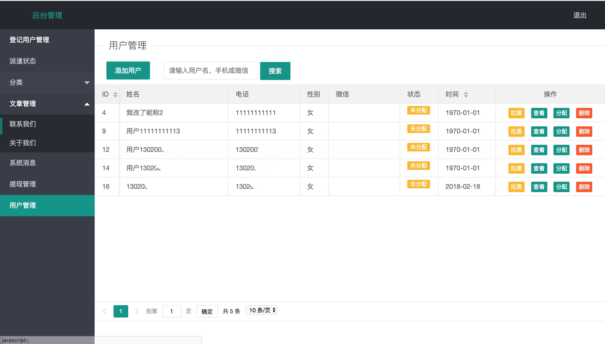

# ThinkPHP 3.2 + Layui开发劳务管理系统

------

> 该项目为本人接手项目，在上传项目时已忽略部分配置文件和数据库，仅作学习参考使用

## 使用框架

- 前端: Layui
- 后端: ThinkPHP 3.2

## 实现功能

- 用户的登录注册，手机验证码的接收
- 用户个人简历信息登记，查询
- 简单文章系统
- 后台用户分配、派遣、拉黑、删除、增加用户等功能
- 手机模板

## 整体布局

* 首页

* 登录、注册

* 个人中心

* 用户管理

* 系统信息分发系统

## 更多

* 用户登记时会给管理员发送邮件，具体 [PHP 发送邮件代码]参考 [网址](http://www.daixiaorui.com/read/16.html)
* 用户邀请二维码生成采用的由 Dantyli 二次开发的jquery.qrcode.js库，最初采用官方jquery.qrcode.js,由于我们邀请链接过长，当我需要在移动端生成一个200*200的二维码时可能容纳不下这些信息，而Dantyli 二次开发的库可以自定义计算模式，使得小型二维码也可以容下更多的信息， 详见:[Dantyli/jquery.qrcode.js-addLOGO**](https://github.com/Dantyli/jquery.qrcode.js-addLOGO)
* Layui自带的分页表格很好用，点赞
* 本人PHP只是皮毛水平，同时也是第一次使用TP自主开发一套系统，其中有很多缺陷，比如 模板引擎、关联模型没有使用到，使得前端代码冗杂。后端有很多function也没有存在的必要。
* 很多地方没有用到ajax，所以登录方面体验不太友好，后续改进。
* [个人博客](http://www.xuzhengke.cn/?p=469)

